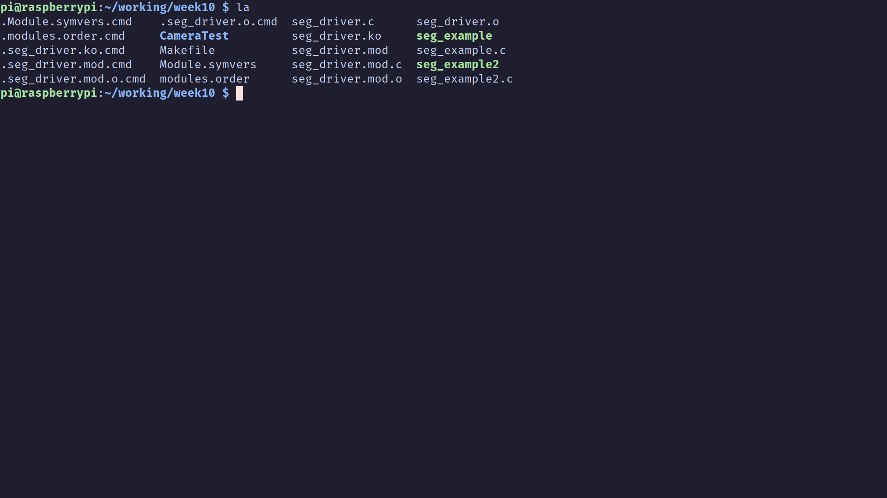
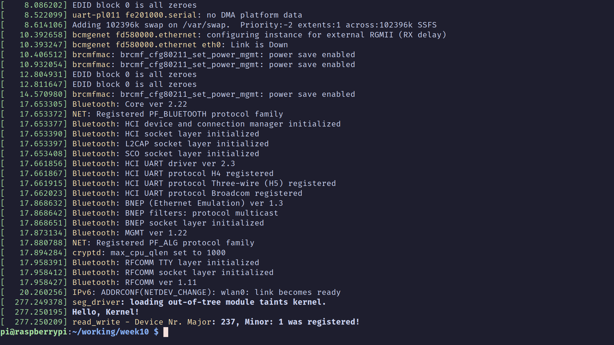
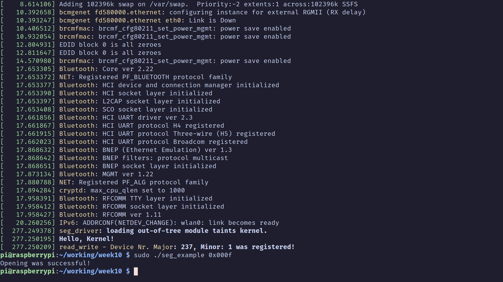
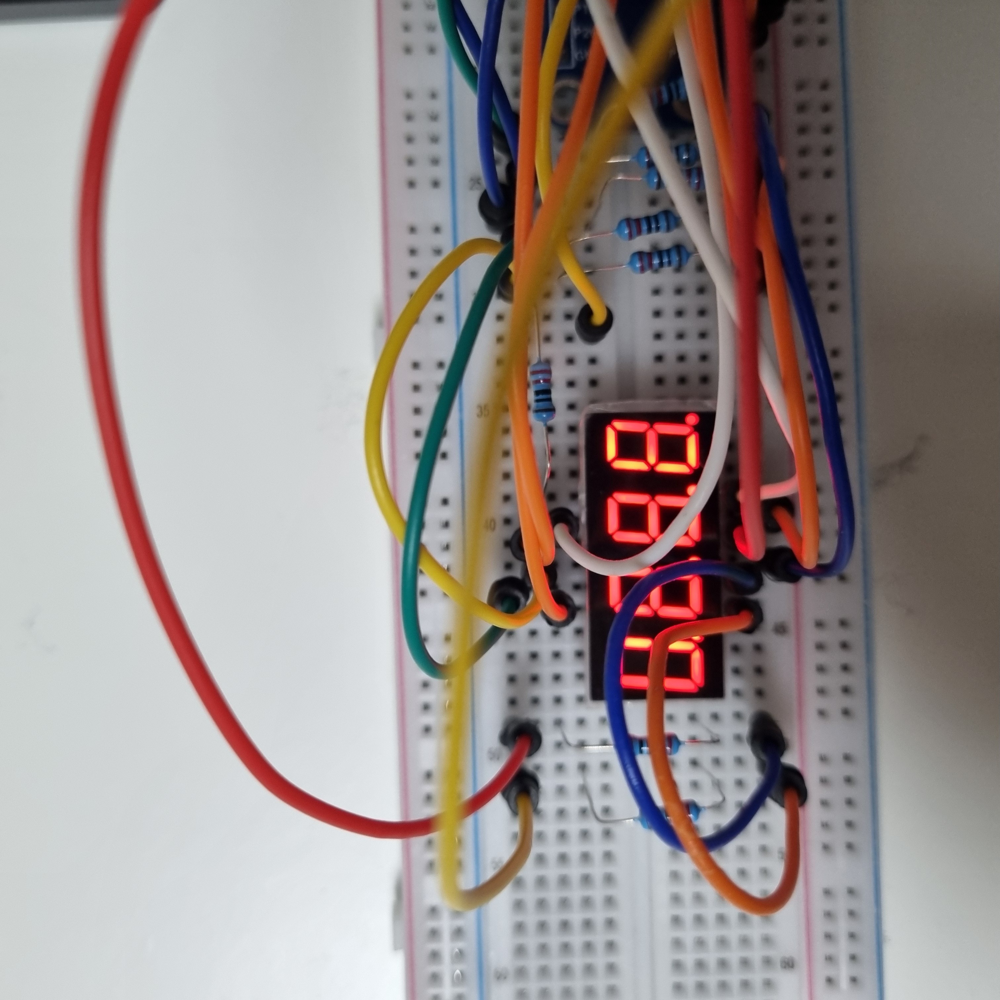
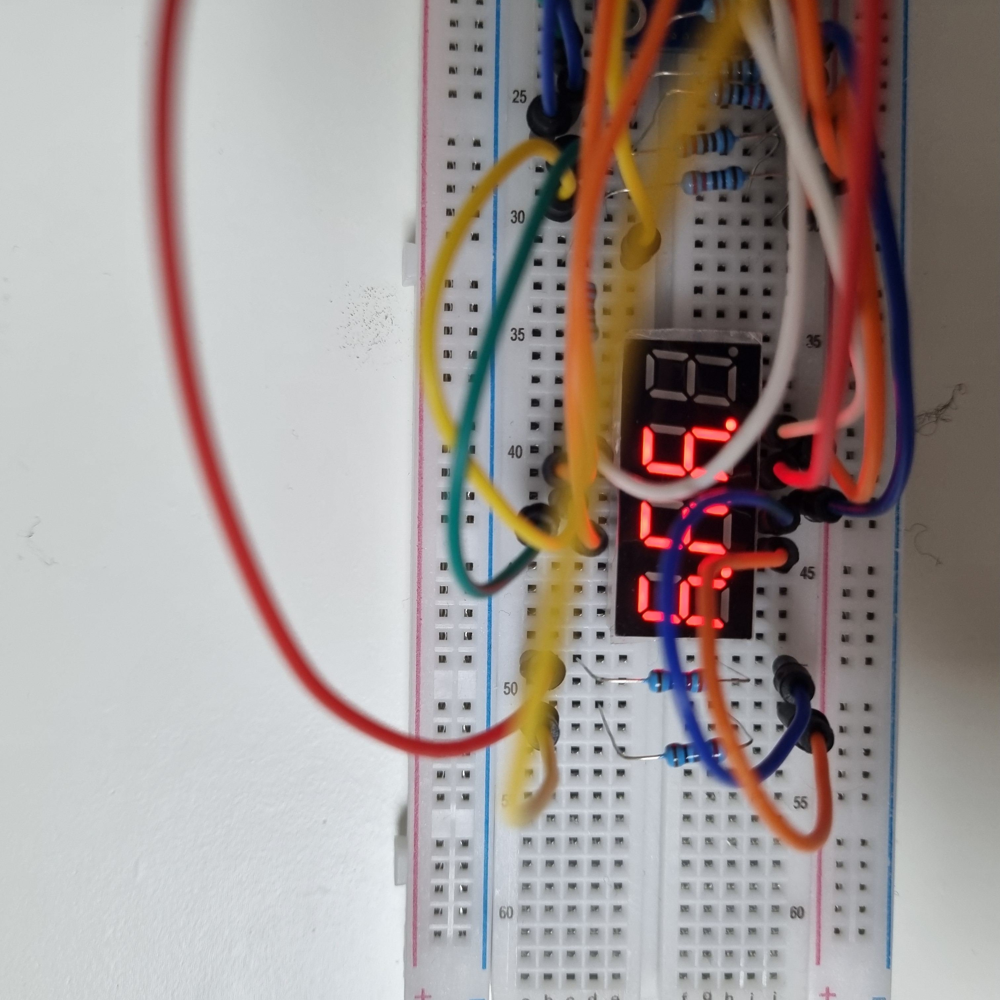
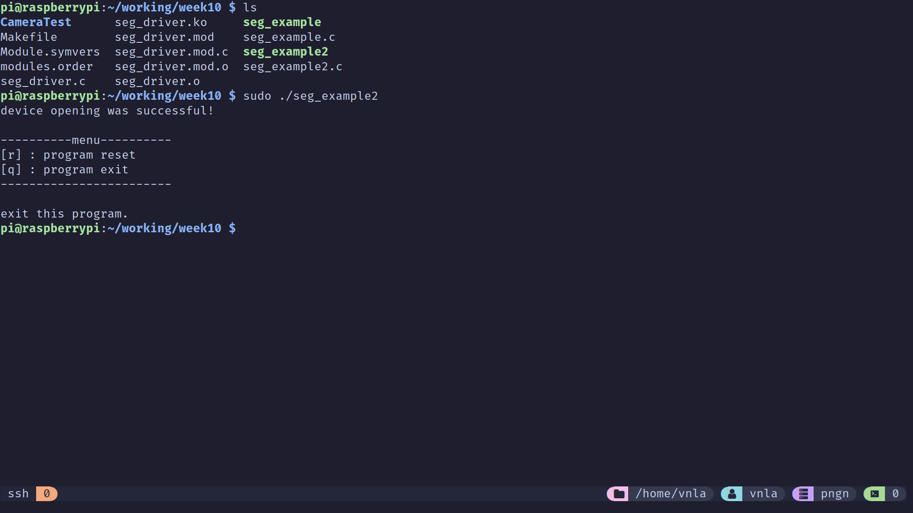
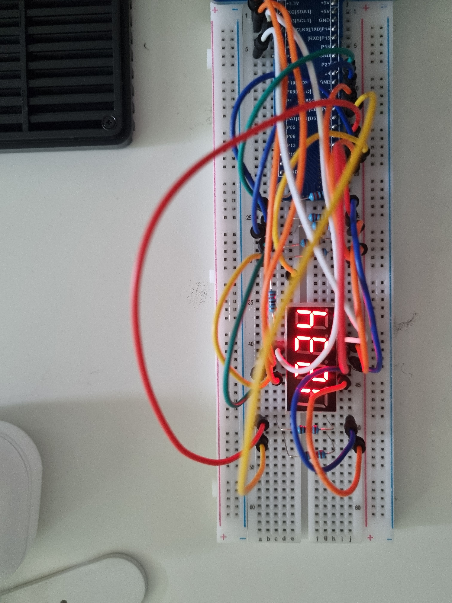

# 임베디드 시스템 #10
> * 담당교수 : 조 용 범
> * 실험날짜 : 2023.11.26
> * 조 : 17조
> * 조원  
>   202110965 이관호  
>   202014122 김진구  
>   201810804 김세연  
1. **Title** : Device Driver *(7segments)*

2. **Name**  
    <17조>  
    202110965 이관호  
    202014122 김진구  
    201810804 김세연  

3. **Abstract & Background**  
    
    이번 주차에서는 블록 디바이스에 중점을 맞추어 어떤 역할을 가지고 있고, I/O 관리에 어떤 기여를 하는지 알아보는 시간을 가진다.  
    정리에 앞서, 지난 주차에서 디바이스 드라이버에는 다음과 같은 종류가 있음을 확인했다.

    | 문자 디바이스 드라이버 | 블록 디바이스 드라이버 | 네트워크 디바이스 드라이버 |
    |-------------------|-------------------|----------------------|
    | * 임의길이 문자열이나 자료가 순차적으로 나열되는 장치들을 다룬다. | * 일정 크기의 버퍼(블록)를 통해 데이터를 처리한다. | * 네트워크 통신을 통해 네트워크 패킷을 송수신한다.
    | * 버퍼 캐시를 사용하지 않으며, 사용자에게 Raw 데이터를 제공한다. | * 파일 시스템에서 관리하고 내부적인 버퍼가 있다. | |
    | * Serial, Console, Keyboard, printer, Mouse 등 | * 하드 디스크, 램 디스크, USB Drive, CD-ROM 등 | * 이더넷, PPP 등 


    블록 디바이스 드라이버는 컴퓨터의 운영 체제에서 블록 디바이스와의 통신을 관리하는 소프트웨어의 일부이다. 여기서 "블록 디바이스"란 데이터를 블록 단위로 저장하고 검색하는 저장 장치를 의미한다. 이러한 블록 디바이스에는 하드 디스크 드라이브, CD-ROM, USB드라이브와 같은 장치들이 포함된다.  

    블록 디바이스 드라이버는 데이터를 관리하는 "블록"이라는 고정된 크기의 단위로 처리한다. 각 블록은 매우 많은 양의 바이트로 이루어져 있으며 (수백에서 수천 바이트), 블록 디바이스 드라이버는 이러한 블록들을 읽고 쓰는 작업을 관리한다.  
    블록 디바이스 드라이버는 데이터를 효율적으로 처리하고 자원을 최적으로 사용하여 시스템의 전반적인 성능을 향상시키기 위해 존재한다. I/O(읽기 및 쓰기)작업의 효율성을 높여 주기 위하여 데이터를 버퍼링하고 캐싱하여 디스크 접근의 빈도를 줄여 주며, 들어오는 여러 입출력 요청을 관리하고 스케줄링한다. 리눅스에는 여러 가지의 입출력 스케줄러가 있고 각각 고유의 방식을 가지는데, 그 종류로는 Noop, Anticipatory, Deadline, CFQ(Complete Fairness Queuing)등이 있다.  

    드라이버는 또한 물리적 저장 장치와의 인터페이스를 제공한다. 따라서 운영 체제는 하드웨어의 세부 사항을 알지 못해도 데이터를 검색하고 저장할 수 있다.  

    이외에도, 현대의 드라이버들은 비동기 I/O를 지원하는데, 이는 다른 작업을 수행하는 동안 I/O요청들을 처리할 수 있음을 의미한다. 또한 블록 디바이스 드라이버는 다양한 하드웨어와 운영 체제 간의 호환성을 제공한다.  

    사용자의 어플리케이션은 파일 시스템을 통해서 블록 디바이스를 사용할 수 있고, 이 과정에 커널의 가상 파일 시스템(VFS)가 관여한다. 또한 커널의 버퍼, 페이지 캐시는 블록 디바이스에서 최근에 읽거나 작성한 데이터 부분을 저장한다.  

    이 실습에서는 7 segment를 제어하기 위한 디바이스 드라이버를 작성하고, 이를 사용하여 7segment를 제어하는 법을 배운다.
    7segment는 7+1개의 LED를 사용해 숫자를 표시하는 GPIO장치로, 제어 포트와 입력 포트로 나누어 장치를 제어한다. 입력 포트에는 원하는 숫자를 표시하기 위한 LED를 A부터 G(혹은 DP)까지 나누어 각 LED를 점등하고, 제어 포트로 원하는 segment의 자리를 표시한다. 제어 포트의 극성에 따라 ANODE / CATHODE로 구분하는데, 이실습에서 사용하는 segment는 common anode 형태이다.

4. **Experimental Results**
    1. 예제 구현 내용
        - A. Source Code
            - **Makefile (Raspberry PI - gcc)**
                ```Makefile
                obj-m += seg_driver.o
                KDIR = ~/working/kernel
                RESULT = seg_example
                SRC = $(RESULT).c
                RESULT2 = seg_example2
                SRC2 = $(RESULT2).c
                CCC = gcc

                all:
                    make -C $(KDIR) M=$(PWD) modules
                    $(CCC) -o $(RESULT) $(SRC)
                    $(CCC) -o $(RESULT2) $(SRC2)

                clean:
                    make -C $(KDIR) M=$(PWD) clean
                    rm -f $(RESULT)
                    rm -f $(RESULT2)
                ```
            - **Makefile (Cross-Compile - arm-linux-gnueabihf-gcc)**
                ```Makefile
                obj-m += seg_driver.o
                KDIR = ~/Workbench/RaspberryPi/kernel
                RESULT = seg_example
                SRC = $(RESULT).c
                RESULT2 = seg_example2
                SRC2 = $(RESULT2).c
                CCC = arm-linux-gnueabihf-gcc

                all:
                    make -C $(KDIR) M=$(PWD) modules
                    $(CCC) -o $(RESULT) $(SRC)
                    $(CCC) -o $(RESULT2) $(SRC2)

                clean:
                    make -C $(KDIR) M=$(PWD) clean
                    rm -f $(RESULT)
                    rm -f $(RESULT2)
                ```
            - **seg_driver.c**
                ```c
                #include <linux/module.h>
                #include <linux/init.h>
                #include <linux/fs.h>
                #include <linux/cdev.h>
                #include <linux/uaccess.h>
                #include <linux/gpio.h>

                // Module Information 
                MODULE_LICENSE("GPL");
                MODULE_AUTHOR("Johannes 4 GNU/Linux");
                MODULE_DESCRIPTION("A simple driver for 7 segments");

                static dev_t my_device_nr;
                static struct class *my_class;
                static struct cdev my_device;

                #define DRIVER_NAME "my_segment"
                #define DRIVER_CLASS "MyModuleClass_seg"

                /**
                * @brief Write Data to buffer
                */
                static ssize_t driver_write(struct file *File, const char *user_buffer, size_t count, loff_t *offs) {
                    int to_copy, not_copied, delta;
                    unsigned short value = 0;

                    to_copy = min(count, sizeof(value));
                    not_copied = copy_from_user(&value, user_buffer, to_copy);

                    /* Setting the segments LED */
                    if (value & (1 << 0)) {
                        gpio_set_value(2, 1);
                    }
                    else {
                        gpio_set_value(2, 0);
                    }

                    if (value & (1 << 1)) {
                        gpio_set_value(3, 1);
                    }
                    else {
                        gpio_set_value(3, 0);
                    }

                    if (value & (1 << 2)) {
                        gpio_set_value(4, 1);
                    }
                    else {
                        gpio_set_value(4, 0);
                    }

                    if (value & (1 << 3)) {
                        gpio_set_value(17, 1);
                    }
                    else {
                        gpio_set_value(17, 0);
                    }

                    if (value & (1 << 4)) {
                        gpio_set_value(21, 1);
                    }
                    else {
                        gpio_set_value(21, 0);
                    }

                    if (value & (1 << 5)) {
                        gpio_set_value(20, 1);
                    }
                    else {
                        gpio_set_value(20, 0);
                    }

                    if (value & (1 << 6)) {
                        gpio_set_value(16, 1);
                    }
                    else {
                        gpio_set_value(16, 0);
                    }

                    if (value & (1 << 7)) {
                        gpio_set_value(12, 1);
                    }
                    else {
                        gpio_set_value(12, 0);
                    }

                    if (value & (1 << 8)) {
                        gpio_set_value(7, 1);
                    }
                    else {
                        gpio_set_value(7, 0);
                    }

                    if (value & (1 << 9)) {
                        gpio_set_value(8, 1);
                    }
                    else {
                        gpio_set_value(8, 0);
                    }

                    if (value & (1 << 10)) {
                        gpio_set_value(25, 1);
                    }
                    else {
                        gpio_set_value(25, 0);
                    }

                    if (value & (1 << 11)) {
                        gpio_set_value(24, 1);
                    }
                    else {
                        gpio_set_value(24, 0);
                    }

                    /* Calculate data */
                    delta = to_copy - not_copied;
                    return delta;
                }

                /**
                * @brief This function is called, when the device file is opened 
                */
                static int driver_open(struct inode *device_file, struct file *instance) {
                    printk("segment - open was called!\n");
                    return 0;
                }

                /**
                * @brief This function is called, when the dvice file is opened
                */
                static int driver_close(struct inode *device_file, struct file *instance) {
                    printk("segment - close was called!\n");
                    return 0;
                }

                static struct file_operations fops = {
                    .owner = THIS_MODULE,
                    .open = driver_open,
                    .release = driver_close,
                    // .read = driver_read,
                    .write = driver_write
                };

                /**
                * @brief This function is called, when the module is loaded into the kernel
                */
                static int __init ModuleInit(void) {
                    printk("Hello, Kernel!\n");

                    /* Allocate a device nr */
                    if (alloc_chrdev_region(&my_device_nr, 0, 1, DRIVER_NAME) < 0) {
                        printk("Device Nr. could not be allocated!\n");
                        return -1;
                    }
                    printk("read_write - Device Nr. Major: %d, Minor: %d was registered!\n", my_device_nr >> 20, my_device_nr && 0xfffff);

                    if ((my_class = class_create(THIS_MODULE, DRIVER_CLASS)) == NULL) {
                        printk("Device class can not be created!\n");
                        goto ClassError;
                    }

                    /* Create device class */
                    if (device_create(my_class, NULL, my_device_nr, NULL, DRIVER_NAME) == NULL) {
                        printk("Can not create device file!\n");
                        goto FileError;
                    }

                    /* Initialize device file */
                    cdev_init(&my_device, &fops);

                    /* Registering devic to kernel */
                    if (cdev_add(&my_device, my_device_nr, 1) == -1) {
                        printk("Registering of device to kernel failed!\n");
                        goto AddError;
                    }

                    /* Set D1~4 segments GPIO */
                    /* GPIO 2 init */
                    if (gpio_request(2, "rpi-gpio-2")) {
                        printk("Can not allocate GPIO 2\n");
                        goto AddError;
                    }

                    /* Set GPIO 2 direction */
                    if (gpio_direction_output(2, 0)) {
                        printk("Can not set GPIO 2 to output!\n");
                        goto Gpio2Error;
                    }

                    /* GPIO 3 init */
                    if (gpio_request(3, "rpi-gpio-3")) {
                        printk("Can not allocate GPIO 3\n");
                        goto AddError;
                    }

                    /* Set GPIO 3 direction */
                    if (gpio_direction_output(3, 0)) {
                        printk("Can not set GPIO 3 to output!\n");
                        goto Gpio3Error;
                    }

                    /* GPIO 4 init */
                    if (gpio_request(4, "rpi-gpio-4")) {
                        printk("Can not allocate GPIO 4\n");
                        goto AddError;
                    }

                    /* Set GPIO 4 direction */
                    if (gpio_direction_output(4, 0)) {
                        printk("Can not set GPIO 4 to output!\n");
                        goto Gpio4Error;
                    }

                    /* GPIO 17 init */
                    if (gpio_request(17, "rpi-gpio-17")) {
                        printk("Can not allocate GPIO 17\n");
                        goto AddError;
                    }

                    /* Set GPIO 17 direction */
                    if (gpio_direction_output(17, 0)) {
                        printk("Can not set GPIO 17 to output!\n");
                        goto Gpio17Error;
                    }

                    /* GPIO 21 init */
                    if (gpio_request(21, "rpi-gpio-21")) {
                        printk("Can not allocate GPIO 21\n");
                        goto AddError;
                    }

                    /* Set GPIO 21 direction */
                    if (gpio_direction_output(21, 0)) {
                        printk("Can not set GPIO 21 to output!\n");
                        goto Gpio21Error;
                    }

                    /* GPIO 20 init */
                    if (gpio_request(20, "rpi-gpio-20")) {
                        printk("Can not allocate GPIO 20\n");
                        goto AddError;
                    }

                    /* Set GPIO 20 direction */
                    if (gpio_direction_output(20, 0)) {
                        printk("Can not set GPIO 20 to output!\n");
                        goto Gpio20Error;
                    }

                    /* GPIO 16 init */
                    if (gpio_request(16, "rpi-gpio-16")) {
                        printk("Can not allocate GPIO 16\n");
                        goto AddError;
                    }

                    /* Set GPIO 16 direction */
                    if (gpio_direction_output(16, 0)) {
                        printk("Can not set GPIO 16 to output!\n");
                        goto Gpio16Error;
                    }

                    /* GPIO 12 init */
                    if (gpio_request(12, "rpi-gpio-12")) {
                        printk("Can not allocate GPIO 12\n");
                        goto AddError;
                    }

                    /* Set GPIO 12 direction */
                    if (gpio_direction_output(12, 0)) {
                        printk("Can not set GPIO 12 to output!\n");
                        goto Gpio12Error;
                    }

                    /* GPIO 7 init */
                    if (gpio_request(7, "rpi-gpio-7")) {
                        printk("Can not allocate GPIO 7\n");
                        goto AddError;
                    }

                    /* Set GPIO 7 direction */
                    if (gpio_direction_output(7, 0)) {
                        printk("Can not set GPIO 7 to output!\n");
                        goto Gpio7Error;
                    }

                    /* GPIO 8 init */
                    if (gpio_request(8, "rpi-gpio-8")) {
                        printk("Can not allocate GPIO 8\n");
                        goto AddError;
                    }

                    /* Set GPIO 8 direction */
                    if (gpio_direction_output(8, 0)) {
                        printk("Can not set GPIO 8 to output!\n");
                        goto Gpio8Error;
                    }

                    /* GPIO 25 init */
                    if (gpio_request(25, "rpi-gpio-25")) {
                        printk("Can not allocate GPIO 25\n");
                        goto AddError;
                    }

                    /* Set GPIO 25 direction */
                    if (gpio_direction_output(25, 0)) {
                        printk("Can not set GPIO 25 to output!\n");
                        goto Gpio25Error;
                    }

                    /* GPIO 24 init */
                    if (gpio_request(24, "rpi-gpio-24")) {
                        printk("Can not allocate GPIO 24\n");
                        goto AddError;
                    }

                    /* Set GPIO 24 direction */
                    if (gpio_direction_output(24, 0)) {
                        printk("Can not set GPIO 24 to output!\n");
                        goto Gpio24Error;
                    }

                    return 0;

                Gpio2Error:
                    gpio_free(2);
                Gpio3Error:
                    gpio_free(3);
                Gpio4Error:
                    gpio_free(4);
                Gpio17Error:
                    gpio_free(17);
                Gpio21Error:
                    gpio_free(21);
                Gpio20Error:
                    gpio_free(20);
                Gpio16Error:
                    gpio_free(16);
                Gpio12Error:
                    gpio_free(12);
                Gpio7Error:
                    gpio_free(7);
                Gpio8Error:
                    gpio_free(8);
                Gpio25Error:
                    gpio_free(25);
                Gpio24Error:
                    gpio_free(24);
                AddError:
                    device_destroy(my_class, my_device_nr);
                FileError:
                    class_destroy(my_class);
                ClassError:
                    unregister_chrdev_region(my_device_nr, 1);
                    return -1;
                }

                /**
                * @brief This function is called, when the module is removed from the kernel
                */
                static void __exit ModuleExit(void) {
                    gpio_set_value(2, 0);
                    gpio_set_value(3, 0);
                    gpio_set_value(4, 0);
                    gpio_set_value(17, 0);
                    gpio_set_value(21, 0);
                    gpio_set_value(20, 0);
                    gpio_set_value(16, 0);
                    gpio_set_value(12, 0);
                    gpio_set_value(7, 0);
                    gpio_set_value(8, 0);
                    gpio_set_value(25, 0);
                    gpio_set_value(24, 0);
                    gpio_free(2);
                    gpio_free(3);
                    gpio_free(4);
                    gpio_free(17);
                    gpio_free(21);
                    gpio_free(20);
                    gpio_free(16);
                    gpio_free(12);
                    gpio_free(7);
                    gpio_free(8);
                    gpio_free(25);
                    gpio_free(24);
                    cdev_del(&my_device);
                    device_destroy(my_class, my_device_nr);
                    class_destroy(my_class);
                    unregister_chrdev_region(my_device_nr, 1);
                    printk("Goodbye, kernel\n");
                }

                module_init(ModuleInit);
                module_exit(ModuleExit);

                ```
            - **seg_example.c**
                ```c
                #include <stdio.h>
                #include <stdlib.h>
                #include <string.h>
                #include <unistd.h>
                #include <fcntl.h>

                int main(int argc, char* argv[]) {

                    short buff;
                    // if you want to read='O_RDONLY' write='O_WRONLY' read$write='O_RDWR'
                    int dev = open("/dev/my_segment", O_RDWR);

                    if (argc < 2 ) {
                        printf("put arg 0x0000 or int\n");
                        return -1;
                    }

                    if (dev == -1) {
                        printf("Opening was not possible!");
                        return -1;
                    }
                    printf("Opening was successful!\n");

                    if (argv[1][0] == '0' && (argv[1][1] == 'x' || argv[1][1] == 'X')) {
                        buff = (unsigned short)strtol(&argv[1][2], NULL, 16);
                    }
                    else {
                        buff = (unsigned short)strtol(&argv[1][0], NULL, 10);
                    }

                    write(dev, &buff, 2);
                    close(dev);
                    return 0;
                }
                ```
            - **seg_example2.c**
                ```c
                #include <stdio.h>
                #include <stdlib.h>
                #include <string.h>
                #include <unistd.h>
                #include <fcntl.h>
                #include <termios.h>

                static struct termios init_setting, new_setting;
                char seg_num[10] = {0xc0, 0xf9, 0xa4, 0xb0, 0x99, 0x92, 0x82, 0xd8, 0x80, 0x90};
                char seg_dnum[10] = {0x40, 0x79, 0x24, 0x30, 0x19, 0x12, 0x02, 0x58, 0x00, 0x10};

                #define D1 0x01;
                #define D2 0x02;
                #define D3 0x04;
                #define D4 0x08;

                void init_keyboard() {
                    tcgetattr(STDIN_FILENO, &init_setting);
                    new_setting = init_setting;
                    new_setting.c_lflag &= ~ICANON;
                    new_setting.c_lflag &= ~ECHO;
                    new_setting.c_cc[VMIN] = 0;
                    new_setting.c_cc[VTIME] = 0;
                    tcsetattr(0, TCSANOW, &new_setting);
                }

                void close_keyboard() {
                    tcsetattr(0, TCSANOW, &init_setting);
                }

                char get_key() {
                    char ch = -1;
                    if (read(STDIN_FILENO, &ch, 1) != 1) ch = -1;
                    return ch;
                }

                void print_menu() {
                    printf("\n----------menu----------\n");
                    printf("[r] : program reset\n");
                    printf("[q] : program exit\n");
                    printf("------------------------\n\n");
                }

                int main(int argc, char* argv[]) {
                    unsigned short data[4];
                    char key;
                    int tmp_n;
                    int delay_time;

                    int dev = open("/dev/my_segment", O_RDWR);
                    
                    if (dev == -1) {
                        printf("Opening was not possible!\n");
                        return -1;
                    }
                    printf("device opening was successful!\n");

                    init_keyboard();
                    print_menu();
                    tmp_n = 0;
                    delay_time = 1000000;

                    data[0] = (seg_num[1] << 4) | D1;
                    data[1] = (seg_num[2] << 4) | D2;
                    data[2] = (seg_num[3] << 4) | D3;
                    data[3] = (seg_num[4] << 4) | D4;

                    while(1) {
                        key = get_key();
                        if (key == 'q') {
                            printf("exit this program.\n");
                            break;
                        }
                        else if (key == 'r') {
                            delay_time = 1000000;
                            tmp_n = 0;
                        }

                        write(dev, &data[tmp_n], 2);
                        usleep(delay_time);

                        tmp_n++;
                        if (tmp_n > 3) {
                            tmp_n = 0;
                            if (delay_time > 5000) {
                                delay_time /= 2;
                            }
                        }
                    }

                    close_keyboard();
                    write(dev, 0x0000, 2);
                    close(dev);
                    return 0;

                ```
        - B. Data
            - `make`

                

            - `$ sudo insmod seg_driver.ko`

                

            - `sudo ./seg_example 0x000f`

                

                

            - `sudo ./seg_example 0x00a7`

                

            - `sudo ./seg_example2`

                

                

        - C. Discussion
            7-segment 드라이버의 내용을 살펴보면, 어떤 버퍼에서 들어오는 값을 받아서 이를 비트 단위로 각각 대응되는 GPIO핀에 써 내려 가는 것을 볼 수 있다.   
            비트에 따라 다음 GPIO 핀들이 반등한다. (나중에 알아보기 쉽게 Index로 표시, 각각 $2^n$ 번째 자리임)
            | 0 | 1 | 2 | 3  | 4  | 5  | 6  | 7  | 8 | 9 | 10 | 11 |
            |---|---|---|----|----|----|----|----|---|---|----|----|
            | 2 | 3 | 4 | 17 | 21 | 20 | 16 | 12 | 7 | 8 | 25 | 24 |

            예를 들어, buff의 내용이 `0x0804` 였다면 이는 이진수로 `0000 1000 0000 0100` 이므로, GPIO의 4번, 12번이 켜지는 식이다.
            예제 1번 `seg_example.c` 에서 0x000f를 입력해 주면 이는 GPIO 2, 3, 4, 17번을 1로 바꾸어 주고, 이는 7segment의 각 자리의 On / Off를 결정하는 pin이므로, 위의 사진에서 확인할 수 있듯 각 7segment자리를 1 2 4 8에 대입했을 때, 마지막 자리가 7인 경우 1, 2, 4에 대응하는 자리의 숫자만 On인 것을 확인할 수 있다.

    2. 과제 구현 내용
        - A. Source Code
            - Makefile
                ```Makefile
                
                ```
            - `seg_driver.c`
                ```c
                
                ```
            - `button_driver.c`
                ```c
                
                ```
            - `segButton.c`
                ```c
                
                ```
        - B. Data

        - C. Discussion

5. Conclusion  
지금까지의 실습과는 다르게 이 실습에서는 서로 다른 두 다바이스 드라이버를 동시에 사용하여 각 디바이스를 제어했다. 이번 실습을 통하여 임의의 실행 코드가 여러 디바이스 드라이버를 제어할 수 있음을 실습했고, 앞으로 프로젝트 등을 진행함에 있어 여러 디바이스를 라즈베리 파이 보드에 연결하여 동시에 제어하는 코드를 작성할 수 있다.  
이전 학기 아두이노에서 했던 것과는 달리 디바이스마다 드라이버를 작성해 주어야 한다는 점에서 난이도가 있다고 볼 수 있었다. 그러나 하드웨어의 동작 방식에 대한 충분한 이해가 있다면 별다른 어려움 없이도 기기를 제어할 수 있음을 보게 되는 시간이었다.  
예제에서 주어진 driver코드를 분석하면 앞으로 더 다양한 접근 방식으로 디바이스를 제어할 수 있을 것이다.

6. References
``