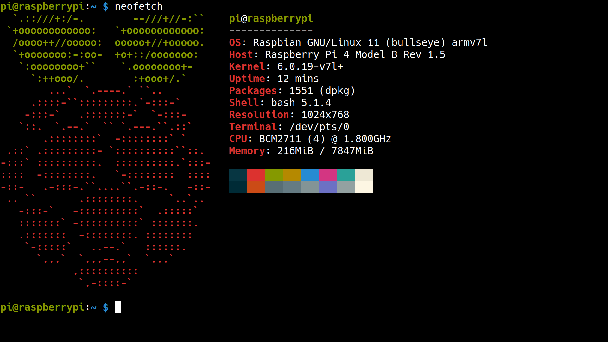

# 0. RaspberryPi
### 건국대학교 전기전자공학부 - 임베디드시스템 17조
> * 🧑‍🏫 **담당교수**  
>   조용범 교수님
> * 👨‍💻 **조원**  
>   202110965 이관호  
>   201810804 김세연  
>   202014122 김진구

> [!IMPORTANT]
> - <strong>TODO List</strong>
> - [X] 레포트 쓰기  
> - [X] 라즈베리파이 강의자료 14 - Tensorflow 실습  
> - [X] 텀프로젝트 주제 및 개요 정하기
> - [X] Tensorflow Lite Shelll Scrpit Edit (Troubleshooting)
> - [ ] 프로젝트 소스코드 작성 (Tensorflow Model Load)
> - [ ] 프로젝트 소스코드 작성 (Device Drivers [0/4])
> - [ ] 프로젝트 소스코드 작성 (main.cpp)

### Raspberry Pi Info
<details>
  <summary>
    <strong>:star::star:Browse Repository (클릭!!)</strong>
  </summary>
  <!DOCTYPE html>
<html>
<head>
 <meta http-equiv="Content-Type" content="text/html; charset=UTF-8">
 <meta name="Author" content="Made by 'tree'">
 <meta name="GENERATOR" content="$Version: $ tree v2.0.2 (c) 1996 - 2022 by Steve Baker, Thomas Moore, Francesc Rocher, Florian Sesser, Kyosuke Tokoro $">
</head>
<body>
		<h1>Directory Tree</h1><p>
	<a href=".">.</a><br>
	├── <a href="./BeginnersGuide-4thEd-Eng_v2.pdf">BeginnersGuide-4thEd-Eng_v2.pdf</a><br>
	├── <a href="./Memo/">Memo</a><br>
	│   └── <a href="./Memo/README.md">README.md</a><br>
	├── <a href="./README.md">README.md</a><br>
	└── <a href="./SourceCode/">SourceCode</a><br>
	&nbsp;&nbsp;&nbsp; ├── <a href="./SourceCode/CMakeLists.txt">CMakeLists.txt</a><br>
	&nbsp;&nbsp;&nbsp; ├── <a href="./SourceCode/Makefile">Makefile</a><br>
	&nbsp;&nbsp;&nbsp; ├── <a href="./SourceCode/README.md">README.md</a><br>
	&nbsp;&nbsp;&nbsp; ├── <a href="./SourceCode/week07/">week07</a><br>
	&nbsp;&nbsp;&nbsp; │   ├── <a href="./SourceCode/week07/button_mmap">button_mmap</a><br>
	&nbsp;&nbsp;&nbsp; │   ├── <a href="./SourceCode/week07/button_mmap.c">button_mmap.c</a><br>
	&nbsp;&nbsp;&nbsp; │   ├── <a href="./SourceCode/week07/keyboard_mmap">keyboard_mmap</a><br>
	&nbsp;&nbsp;&nbsp; │   ├── <a href="./SourceCode/week07/keyboard_mmap.c">keyboard_mmap.c</a><br>
	&nbsp;&nbsp;&nbsp; │   ├── <a href="./SourceCode/week07/led_mmap">led_mmap</a><br>
	&nbsp;&nbsp;&nbsp; │   └── <a href="./SourceCode/week07/led_mmap.c">led_mmap.c</a><br>
	&nbsp;&nbsp;&nbsp; ├── <a href="./SourceCode/week10/">week10</a><br>
	&nbsp;&nbsp;&nbsp; │   ├── <a href="./SourceCode/week10/Makefile">Makefile</a><br>
	&nbsp;&nbsp;&nbsp; │   ├── <a href="./SourceCode/week10/modules.order">modules.order</a><br>
	&nbsp;&nbsp;&nbsp; │   ├── <a href="./SourceCode/week10/Module.symvers">Module.symvers</a><br>
	&nbsp;&nbsp;&nbsp; │   ├── <a href="./SourceCode/week10/seg_driver.c">seg_driver.c</a><br>
	&nbsp;&nbsp;&nbsp; │   ├── <a href="./SourceCode/week10/seg_driver.ko">seg_driver.ko</a><br>
	&nbsp;&nbsp;&nbsp; │   ├── <a href="./SourceCode/week10/seg_driver.mod">seg_driver.mod</a><br>
	&nbsp;&nbsp;&nbsp; │   ├── <a href="./SourceCode/week10/seg_driver.mod.c">seg_driver.mod.c</a><br>
	&nbsp;&nbsp;&nbsp; │   ├── <a href="./SourceCode/week10/seg_driver.mod.o">seg_driver.mod.o</a><br>
	&nbsp;&nbsp;&nbsp; │   ├── <a href="./SourceCode/week10/seg_driver.o">seg_driver.o</a><br>
	&nbsp;&nbsp;&nbsp; │   ├── <a href="./SourceCode/week10/seg_example">seg_example</a><br>
	&nbsp;&nbsp;&nbsp; │   ├── <a href="./SourceCode/week10/seg_example2">seg_example2</a><br>
	&nbsp;&nbsp;&nbsp; │   ├── <a href="./SourceCode/week10/seg_example2.c">seg_example2.c</a><br>
	&nbsp;&nbsp;&nbsp; │   ├── <a href="./SourceCode/week10/seg_example.c">seg_example.c</a><br>
	&nbsp;&nbsp;&nbsp; │   ├── <a href="./SourceCode/week10/temp/">temp</a><br>
	&nbsp;&nbsp;&nbsp; │   │   └── <a href="./SourceCode/week10/temp/Makefile">Makefile</a><br>
	&nbsp;&nbsp;&nbsp; │   └── <a href="./SourceCode/week10/test.png">test.png</a><br>
	&nbsp;&nbsp;&nbsp; ├── <a href="./SourceCode/week11/">week11</a><br>
	&nbsp;&nbsp;&nbsp; │   ├── <a href="./SourceCode/week11/opencv_example/">opencv_example</a><br>
	&nbsp;&nbsp;&nbsp; │   │   ├── <a href="./SourceCode/week11/opencv_example/camera">camera</a><br>
	&nbsp;&nbsp;&nbsp; │   │   ├── <a href="./SourceCode/week11/opencv_example/camera_example.cpp">camera_example.cpp</a><br>
	&nbsp;&nbsp;&nbsp; │   │   ├── <a href="./SourceCode/week11/opencv_example/file.h264">file.h264</a><br>
	&nbsp;&nbsp;&nbsp; │   │   ├── <a href="./SourceCode/week11/opencv_example/gray_example">gray_example</a><br>
	&nbsp;&nbsp;&nbsp; │   │   ├── <a href="./SourceCode/week11/opencv_example/gray_example.cpp">gray_example.cpp</a><br>
	&nbsp;&nbsp;&nbsp; │   │   ├── <a href="./SourceCode/week11/opencv_example/gray_image.bmp">gray_image.bmp</a><br>
	&nbsp;&nbsp;&nbsp; │   │   ├── <a href="./SourceCode/week11/opencv_example/install_cv4.5.1_rasbian.sh">install_cv4.5.1_rasbian.sh</a><br>
	&nbsp;&nbsp;&nbsp; │   │   ├── <a href="./SourceCode/week11/opencv_example/Lenna.png">Lenna.png</a><br>
	&nbsp;&nbsp;&nbsp; │   │   ├── <a href="./SourceCode/week11/opencv_example/outcpp01.avi">outcpp01.avi</a><br>
	&nbsp;&nbsp;&nbsp; │   │   └── <a href="./SourceCode/week11/opencv_example/sample_image.bmp">sample_image.bmp</a><br>
	&nbsp;&nbsp;&nbsp; │   └── <a href="./SourceCode/week11/README.md">README.md</a><br>
	&nbsp;&nbsp;&nbsp; └── <a href="./SourceCode/week12/">week12</a><br>
	&nbsp;&nbsp;&nbsp; &nbsp;&nbsp;&nbsp; ├── <a href="./SourceCode/week12/coco_ssd_mobilenet_v1_1.0_quant_2018_06_29.zip">coco_ssd_mobilenet_v1_1.0_quant_2018_06_29.zip</a><br>
	&nbsp;&nbsp;&nbsp; &nbsp;&nbsp;&nbsp; ├── <a href="./SourceCode/week12/detect.tflite">detect.tflite</a><br>
	&nbsp;&nbsp;&nbsp; &nbsp;&nbsp;&nbsp; ├── <a href="./SourceCode/week12/install_tensorflowlite2.6.0_rasbian.sh">install_tensorflowlite2.6.0_rasbian.sh</a><br>
	&nbsp;&nbsp;&nbsp; &nbsp;&nbsp;&nbsp; ├── <a href="./SourceCode/week12/labelmap.txt">labelmap.txt</a><br>
	&nbsp;&nbsp;&nbsp; &nbsp;&nbsp;&nbsp; ├── <a href="./SourceCode/week12/ReportPictures/">ReportPictures</a><br>
	&nbsp;&nbsp;&nbsp; &nbsp;&nbsp;&nbsp; │   ├── <a href="./SourceCode/week12/ReportPictures/coco_unzip%ED%9B%84_git_clone.png">coco_unzip후_git_clone.png</a><br>
	&nbsp;&nbsp;&nbsp; &nbsp;&nbsp;&nbsp; │   ├── <a href="./SourceCode/week12/ReportPictures/coco_unzip.png">coco_unzip.png</a><br>
	&nbsp;&nbsp;&nbsp; &nbsp;&nbsp;&nbsp; │   ├── <a href="./SourceCode/week12/ReportPictures/ldconfig_&amp;_wget.png">ldconfig_&amp;_wget.png</a><br>
	&nbsp;&nbsp;&nbsp; &nbsp;&nbsp;&nbsp; │   ├── <a href="./SourceCode/week12/ReportPictures/%EA%B2%B0%EA%B3%BC%EC%82%AC%EC%A7%84%ED%99%95%EC%9D%B8.png">결과사진확인.png</a><br>
	&nbsp;&nbsp;&nbsp; &nbsp;&nbsp;&nbsp; │   ├── <a href="./SourceCode/week12/ReportPictures/%ED%85%90%EC%84%9C%ED%94%8C%EB%A1%9C%EC%9A%B0_%EC%84%A4%EC%B9%98_%ED%99%95%EC%9D%B8.png">텐서플로우_설치_확인.png</a><br>
	&nbsp;&nbsp;&nbsp; &nbsp;&nbsp;&nbsp; │   ├── <a href="./SourceCode/week12/ReportPictures/%EC%84%A4%EC%B9%98%ED%8C%8C%EC%9D%BC_%EB%8B%A4%EC%9A%B4%EB%A1%9C%EB%93%9C.png">설치파일_다운로드.png</a><br>
	&nbsp;&nbsp;&nbsp; &nbsp;&nbsp;&nbsp; │   ├── <a href="./SourceCode/week12/ReportPictures/%EC%84%A4%EC%B9%98%ED%8C%8C%EC%9D%BC_%EA%B6%8C%ED%95%9C%EB%B3%B4%EC%97%AC_%EB%B0%8F_%EC%8B%A4%ED%96%89.png">설치파일_권한보여_및_실행.png</a><br>
	&nbsp;&nbsp;&nbsp; &nbsp;&nbsp;&nbsp; │   └── <a href="./SourceCode/week12/ReportPictures/%ED%8C%8C%EC%9D%B4%EC%8D%AC_%EC%BD%94%EB%93%9C%EC%8B%A4%ED%96%89.png">파이썬_코드실행.png</a><br>
	&nbsp;&nbsp;&nbsp; &nbsp;&nbsp;&nbsp; ├── <a href="./SourceCode/week12/TensorFlow-Lite-Object-Detection-on-Android-and-Raspberry-Pi/">TensorFlow-Lite-Object-Detection-on-Android-and-Raspberry-Pi</a><br>
	&nbsp;&nbsp;&nbsp; &nbsp;&nbsp;&nbsp; │   ├── <a href="./SourceCode/week12/TensorFlow-Lite-Object-Detection-on-Android-and-Raspberry-Pi/Android/">Android</a><br>
	&nbsp;&nbsp;&nbsp; &nbsp;&nbsp;&nbsp; │   │   └── <a href="./SourceCode/week12/TensorFlow-Lite-Object-Detection-on-Android-and-Raspberry-Pi/Android/placeholder.txt">placeholder.txt</a><br>
	&nbsp;&nbsp;&nbsp; &nbsp;&nbsp;&nbsp; │   ├── <a href="./SourceCode/week12/TensorFlow-Lite-Object-Detection-on-Android-and-Raspberry-Pi/deploy_guides/">deploy_guides</a><br>
	&nbsp;&nbsp;&nbsp; &nbsp;&nbsp;&nbsp; │   │   ├── <a href="./SourceCode/week12/TensorFlow-Lite-Object-Detection-on-Android-and-Raspberry-Pi/deploy_guides/Raspberry_Pi_Guide.md">Raspberry_Pi_Guide.md</a><br>
	&nbsp;&nbsp;&nbsp; &nbsp;&nbsp;&nbsp; │   │   └── <a href="./SourceCode/week12/TensorFlow-Lite-Object-Detection-on-Android-and-Raspberry-Pi/deploy_guides/Windows_TFLite_Guide.md">Windows_TFLite_Guide.md</a><br>
	&nbsp;&nbsp;&nbsp; &nbsp;&nbsp;&nbsp; │   ├── <a href="./SourceCode/week12/TensorFlow-Lite-Object-Detection-on-Android-and-Raspberry-Pi/doc/">doc</a><br>
	&nbsp;&nbsp;&nbsp; &nbsp;&nbsp;&nbsp; │   │   ├── <a href="./SourceCode/week12/TensorFlow-Lite-Object-Detection-on-Android-and-Raspberry-Pi/doc/BSR_demo.gif">BSR_demo.gif</a><br>
	&nbsp;&nbsp;&nbsp; &nbsp;&nbsp;&nbsp; │   │   ├── <a href="./SourceCode/week12/TensorFlow-Lite-Object-Detection-on-Android-and-Raspberry-Pi/doc/BSR_directory1.png">BSR_directory1.png</a><br>
	&nbsp;&nbsp;&nbsp; &nbsp;&nbsp;&nbsp; │   │   ├── <a href="./SourceCode/week12/TensorFlow-Lite-Object-Detection-on-Android-and-Raspberry-Pi/doc/calculate-mAP-demo1.gif">calculate-mAP-demo1.gif</a><br>
	&nbsp;&nbsp;&nbsp; &nbsp;&nbsp;&nbsp; │   │   ├── <a href="./SourceCode/week12/TensorFlow-Lite-Object-Detection-on-Android-and-Raspberry-Pi/doc/camera_enabled.png">camera_enabled.png</a><br>
	&nbsp;&nbsp;&nbsp; &nbsp;&nbsp;&nbsp; │   │   ├── <a href="./SourceCode/week12/TensorFlow-Lite-Object-Detection-on-Android-and-Raspberry-Pi/doc/colab_upload_button.png">colab_upload_button.png</a><br>
	&nbsp;&nbsp;&nbsp; &nbsp;&nbsp;&nbsp; │   │   ├── <a href="./SourceCode/week12/TensorFlow-Lite-Object-Detection-on-Android-and-Raspberry-Pi/doc/Coral_and_EdgeTPU2.png">Coral_and_EdgeTPU2.png</a><br>
	&nbsp;&nbsp;&nbsp; &nbsp;&nbsp;&nbsp; │   │   ├── <a href="./SourceCode/week12/TensorFlow-Lite-Object-Detection-on-Android-and-Raspberry-Pi/doc/labeled_image_example2.png">labeled_image_example2.png</a><br>
	&nbsp;&nbsp;&nbsp; &nbsp;&nbsp;&nbsp; │   │   ├── <a href="./SourceCode/week12/TensorFlow-Lite-Object-Detection-on-Android-and-Raspberry-Pi/doc/labeled_image_examples.png">labeled_image_examples.png</a><br>
	&nbsp;&nbsp;&nbsp; &nbsp;&nbsp;&nbsp; │   │   ├── <a href="./SourceCode/week12/TensorFlow-Lite-Object-Detection-on-Android-and-Raspberry-Pi/doc/labelmap_example.png">labelmap_example.png</a><br>
	&nbsp;&nbsp;&nbsp; &nbsp;&nbsp;&nbsp; │   │   ├── <a href="./SourceCode/week12/TensorFlow-Lite-Object-Detection-on-Android-and-Raspberry-Pi/doc/local_training_guide.md">local_training_guide.md</a><br>
	&nbsp;&nbsp;&nbsp; &nbsp;&nbsp;&nbsp; │   │   ├── <a href="./SourceCode/week12/TensorFlow-Lite-Object-Detection-on-Android-and-Raspberry-Pi/doc/MSYS_window.png">MSYS_window.png</a><br>
	&nbsp;&nbsp;&nbsp; &nbsp;&nbsp;&nbsp; │   │   ├── <a href="./SourceCode/week12/TensorFlow-Lite-Object-Detection-on-Android-and-Raspberry-Pi/doc/object_detection_folder.png">object_detection_folder.png</a><br>
	&nbsp;&nbsp;&nbsp; &nbsp;&nbsp;&nbsp; │   │   ├── <a href="./SourceCode/week12/TensorFlow-Lite-Object-Detection-on-Android-and-Raspberry-Pi/doc/squirrels!!.png">squirrels!!.png</a><br>
	&nbsp;&nbsp;&nbsp; &nbsp;&nbsp;&nbsp; │   │   ├── <a href="./SourceCode/week12/TensorFlow-Lite-Object-Detection-on-Android-and-Raspberry-Pi/doc/TFL_download_links.png">TFL_download_links.png</a><br>
	&nbsp;&nbsp;&nbsp; &nbsp;&nbsp;&nbsp; │   │   ├── <a href="./SourceCode/week12/TensorFlow-Lite-Object-Detection-on-Android-and-Raspberry-Pi/doc/tflite1_folder.png">tflite1_folder.png</a><br>
	&nbsp;&nbsp;&nbsp; &nbsp;&nbsp;&nbsp; │   │   ├── <a href="./SourceCode/week12/TensorFlow-Lite-Object-Detection-on-Android-and-Raspberry-Pi/doc/TFLite-vs-EdgeTPU.gif">TFLite-vs-EdgeTPU.gif</a><br>
	&nbsp;&nbsp;&nbsp; &nbsp;&nbsp;&nbsp; │   │   ├── <a href="./SourceCode/week12/TensorFlow-Lite-Object-Detection-on-Android-and-Raspberry-Pi/doc/training_in_progress.png">training_in_progress.png</a><br>
	&nbsp;&nbsp;&nbsp; &nbsp;&nbsp;&nbsp; │   │   ├── <a href="./SourceCode/week12/TensorFlow-Lite-Object-Detection-on-Android-and-Raspberry-Pi/doc/YouTube_video1.JPG">YouTube_video1.JPG</a><br>
	&nbsp;&nbsp;&nbsp; &nbsp;&nbsp;&nbsp; │   │   └── <a href="./SourceCode/week12/TensorFlow-Lite-Object-Detection-on-Android-and-Raspberry-Pi/doc/YouTube_video2.png">YouTube_video2.png</a><br>
	&nbsp;&nbsp;&nbsp; &nbsp;&nbsp;&nbsp; │   ├── <a href="./SourceCode/week12/TensorFlow-Lite-Object-Detection-on-Android-and-Raspberry-Pi/examples/">examples</a><br>
	&nbsp;&nbsp;&nbsp; &nbsp;&nbsp;&nbsp; │   │   ├── <a href="./SourceCode/week12/TensorFlow-Lite-Object-Detection-on-Android-and-Raspberry-Pi/examples/ChangeCounter.py">ChangeCounter.py</a><br>
	&nbsp;&nbsp;&nbsp; &nbsp;&nbsp;&nbsp; │   │   └── <a href="./SourceCode/week12/TensorFlow-Lite-Object-Detection-on-Android-and-Raspberry-Pi/examples/README.md">README.md</a><br>
	&nbsp;&nbsp;&nbsp; &nbsp;&nbsp;&nbsp; │   ├── <a href="./SourceCode/week12/TensorFlow-Lite-Object-Detection-on-Android-and-Raspberry-Pi/get_pi_requirements.sh">get_pi_requirements.sh</a><br>
	&nbsp;&nbsp;&nbsp; &nbsp;&nbsp;&nbsp; │   ├── <a href="./SourceCode/week12/TensorFlow-Lite-Object-Detection-on-Android-and-Raspberry-Pi/LICENSE">LICENSE</a><br>
	&nbsp;&nbsp;&nbsp; &nbsp;&nbsp;&nbsp; │   ├── <a href="./SourceCode/week12/TensorFlow-Lite-Object-Detection-on-Android-and-Raspberry-Pi/README.md">README.md</a><br>
	&nbsp;&nbsp;&nbsp; &nbsp;&nbsp;&nbsp; │   ├── <a href="./SourceCode/week12/TensorFlow-Lite-Object-Detection-on-Android-and-Raspberry-Pi/results/">results</a><br>
	&nbsp;&nbsp;&nbsp; &nbsp;&nbsp;&nbsp; │   │   ├── <a href="./SourceCode/week12/TensorFlow-Lite-Object-Detection-on-Android-and-Raspberry-Pi/results/test1.jpg">test1.jpg</a><br>
	&nbsp;&nbsp;&nbsp; &nbsp;&nbsp;&nbsp; │   │   └── <a href="./SourceCode/week12/TensorFlow-Lite-Object-Detection-on-Android-and-Raspberry-Pi/results/test1.txt">test1.txt</a><br>
	&nbsp;&nbsp;&nbsp; &nbsp;&nbsp;&nbsp; │   ├── <a href="./SourceCode/week12/TensorFlow-Lite-Object-Detection-on-Android-and-Raspberry-Pi/test1.jpg">test1.jpg</a><br>
	&nbsp;&nbsp;&nbsp; &nbsp;&nbsp;&nbsp; │   ├── <a href="./SourceCode/week12/TensorFlow-Lite-Object-Detection-on-Android-and-Raspberry-Pi/test.mp4">test.mp4</a><br>
	&nbsp;&nbsp;&nbsp; &nbsp;&nbsp;&nbsp; │   ├── <a href="./SourceCode/week12/TensorFlow-Lite-Object-Detection-on-Android-and-Raspberry-Pi/TFLite_detection_image.py">TFLite_detection_image.py</a><br>
	&nbsp;&nbsp;&nbsp; &nbsp;&nbsp;&nbsp; │   ├── <a href="./SourceCode/week12/TensorFlow-Lite-Object-Detection-on-Android-and-Raspberry-Pi/TFLite_detection_stream.py">TFLite_detection_stream.py</a><br>
	&nbsp;&nbsp;&nbsp; &nbsp;&nbsp;&nbsp; │   ├── <a href="./SourceCode/week12/TensorFlow-Lite-Object-Detection-on-Android-and-Raspberry-Pi/TFLite_detection_video.py">TFLite_detection_video.py</a><br>
	&nbsp;&nbsp;&nbsp; &nbsp;&nbsp;&nbsp; │   ├── <a href="./SourceCode/week12/TensorFlow-Lite-Object-Detection-on-Android-and-Raspberry-Pi/TFLite_detection_webcam.py">TFLite_detection_webcam.py</a><br>
	&nbsp;&nbsp;&nbsp; &nbsp;&nbsp;&nbsp; │   ├── <a href="./SourceCode/week12/TensorFlow-Lite-Object-Detection-on-Android-and-Raspberry-Pi/Train_TFLite1_Object_Detection_Model.ipynb">Train_TFLite1_Object_Detection_Model.ipynb</a><br>
	&nbsp;&nbsp;&nbsp; &nbsp;&nbsp;&nbsp; │   ├── <a href="./SourceCode/week12/TensorFlow-Lite-Object-Detection-on-Android-and-Raspberry-Pi/Train_TFLite2_Object_Detction_Model.ipynb">Train_TFLite2_Object_Detction_Model.ipynb</a><br>
	&nbsp;&nbsp;&nbsp; &nbsp;&nbsp;&nbsp; │   └── <a href="./SourceCode/week12/TensorFlow-Lite-Object-Detection-on-Android-and-Raspberry-Pi/util_scripts/">util_scripts</a><br>
	&nbsp;&nbsp;&nbsp; &nbsp;&nbsp;&nbsp; │   &nbsp;&nbsp;&nbsp; ├── <a href="./SourceCode/week12/TensorFlow-Lite-Object-Detection-on-Android-and-Raspberry-Pi/util_scripts/calculate_map_cartucho.py">calculate_map_cartucho.py</a><br>
	&nbsp;&nbsp;&nbsp; &nbsp;&nbsp;&nbsp; │   &nbsp;&nbsp;&nbsp; ├── <a href="./SourceCode/week12/TensorFlow-Lite-Object-Detection-on-Android-and-Raspberry-Pi/util_scripts/create_csv.py">create_csv.py</a><br>
	&nbsp;&nbsp;&nbsp; &nbsp;&nbsp;&nbsp; │   &nbsp;&nbsp;&nbsp; ├── <a href="./SourceCode/week12/TensorFlow-Lite-Object-Detection-on-Android-and-Raspberry-Pi/util_scripts/create_tfrecord.py">create_tfrecord.py</a><br>
	&nbsp;&nbsp;&nbsp; &nbsp;&nbsp;&nbsp; │   &nbsp;&nbsp;&nbsp; ├── <a href="./SourceCode/week12/TensorFlow-Lite-Object-Detection-on-Android-and-Raspberry-Pi/util_scripts/README.md">README.md</a><br>
	&nbsp;&nbsp;&nbsp; &nbsp;&nbsp;&nbsp; │   &nbsp;&nbsp;&nbsp; └── <a href="./SourceCode/week12/TensorFlow-Lite-Object-Detection-on-Android-and-Raspberry-Pi/util_scripts/train_val_test_split.py">train_val_test_split.py</a><br>
	&nbsp;&nbsp;&nbsp; &nbsp;&nbsp;&nbsp; └── <a href="./SourceCode/week12/tensorflow.zip">tensorflow.zip</a><br>
<br><br><p>

16 directories, 93 files

</p>
</body>
</html>
</details>

- 🔭 OS : ~~Buildroot~~ Raspbian (RaspberryPi OS)  
- 💻 Kernel Version : 6.0.19-v7l+ (32bit arm architecture)  
- 🌱 Board Version : RaspberryPi 4 - Model B    
- 🍓 Raspberry Pi *(neofetch)*

<picture>
  <source media="(prefers-color-scheme: dark)" srcset="./.readme-images/rasp-neofetch-dark.png">
  <source media="(prefers-color-scheme: light)" srcset="./.readme-images/rasp-neofetch-light.png">
  
</picture>

# 1. TroubleShooting
* *Example Errors*
	* [week11](./SourceCode/week11/README.md)

# 2. Git

### Github Clone Code
```
$ git clone https://github.com/vanillaPenguin/RaspberryPi.git
```
Token과 Clone하면 push등을 할때 상당히 편해진다.  
`https://`와 `github.com`사이에 토큰을 넣고 `@`을 마지막에 붙여 줄 수 있다
```
$ git clone https://[ TOKEN ]@github.com/vanillaPenguin/RaspberryPi.git
```

> [!IMPORTANT]
> * :octocat:**Github 레포지토리 사용법**
> 1. 로컬에서 사용할 Repository를 Clone해 온다 (Token과 함께 Clone 하면 편하다)
> 2. 내용을 내 입맛에 맞게 수정한다 (파일 생성 및 삭제, 수정 등)
> 3. 변경 상태를 Staging Area에 저장해 준다.
>    * Staging Area 란 변경된 내용들이 Commit되기 이전 대기 상태에 들어가는 것을 말한다
>    ```bash
>    $ git add [Directory or File path]
>    ```
> 4. 변경 내용 (Staging Area에 있는 내용)을 메세지와 함께 Commit한다.
>     * 이때 커밋된 메세지는 레포지토리에 남아서, 수정된 내용들에 대해 붙어서 따라다닌다
>    ```bash
>    $ git commit -m "message"
>    ```
> 5. 변경 내용 업로드
>    * 제공된 토큰은 아마 줄 수 있는 모든 권한이 부여된 상태일 것이므로, main브랜치에 바로 push가 가능하다.
>    * 따라서 변경 내용을 push할 때 반드시 내용이 올바른지, 잘못 건드린 것은 없는지 확인해야 한다.
>    ```bash
>    $ git push
>    ```
>    

# 3. SSH
* 라즈베리 파이는 부팅과 동시에 연결 가능한 네트워크를 찾고, 연결한다.
* 만약 라즈베리 파이가 올바르게 연결되었다면, 외부에서 ssh를 통해서 접속할 수 있다.
그러나 라즈베리 파이와 ssh로 연결하려면, PC와 같은 네트워크에 연결되어 있어야 하고, 기타 네트워크 설정이 맞아야 한다 (어떤 wifi를 사용하느냐에 따라서 다른데, 내부 디바이스들의 통신을 막아둔 공유기들이 있다).
* ssh로 연결하려면 다음과 같은 코드를 연결하고자 하는 PC에서 실행해 주면 된다
```bash
$ ssh pi@raspberrypi.local
```
또는
```bash
$ ssh pi@[RaspberryPi_IP]
```
> [!NOTE]
> * 🍓 **라즈베리 파이를 wifi에 연결할 수 없는 경우**
> 	1. 다음의 코드를 실행하여 현재 사용 가능한 네트워크의 목록을 확인할 수 있다.
>    		```bash
>    		# nmcli device wifi list
>    		```
> 	2. 사용 가능한 네트워크가 있다면, 다음의 코드를 통해 연결할 수 있다.  
> 		이때, SSID가 와이파이 이름, PASSWORD가 비번이다.
>   		```bash
>    		# nmcli device wifi connect [SSID] password [PASSWORD]
>    		```
>
> * ⁉️ **라즈베리 파이의 IP를 모르겠다면?**
> 	* 다음의 코드를 실행해서 IP를 알아낼 수 있다.  
>   	이때 inet 옆에 xxx.xx.x.xx/xx 이런식으로 되어 있을 텐데, `/`가 나오기 이전까지가 ip 주소이다.
>    	```bash
>    	# ip a
>    	```
>    

# 4. VNC

# 5. Raspberry Pi 사용이 끝났다면
* 다음과 같은 코드를 실행해서 라즈베리 파이를 올바르게 종료할 수 있다.
  이는 `# sudo shutdown -h now`와 같다.
  ```bash
  # sudo shutdown now
  ```  
* 혹은, 일정 시간이 지난 후에 전원이 꺼지기를 바란다면 다음과 같이 쓸 수 있다. 예를 들어, 5분 뒤에 전원을 끄는 명령어는 다음과 같다.
  ```bash
  # sudo shutdown -h +5
  ```
  
  
  
    
