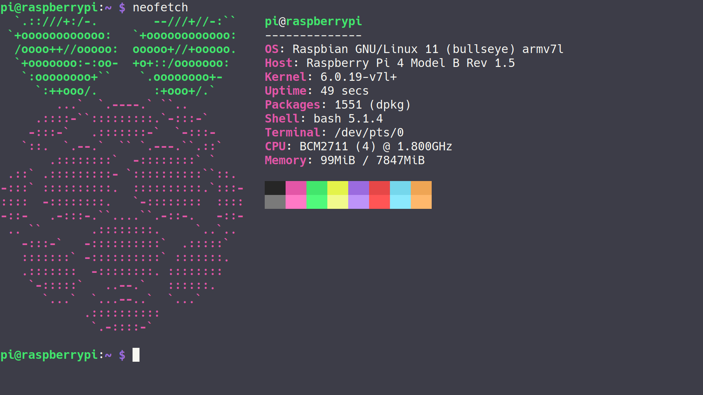

# 0. RaspberryPi
### 건국대학교 전기전자공학부 - 임베디드시스템 17조
> * 🧑‍🏫 **담당교수**  
>   조용범 교수님
> * 👨‍💻 **조원**  
>   202110965 이관호  
>   201810804 김세연  
>   202014122 김진구

### Raspberry Pi Info
- 🔭 OS : ~~Buildroot~~ Raspbian (RaspberryPi OS)
- 💻 Kernel Version : 6.0.19-v7l+ (32bit arm architecture)
- 🌱 Board Version : RaspberryPi 4 - Model B  
- 🍓 Raspberry Pi *(neofetch)*
<div align="center">
  
</div>

<!--   -->

### Repository Info
<details>
  <summary>Show Tree</summary>
  <!DOCTYPE html>
<html>
<head>
 <meta http-equiv="Content-Type" content="text/html; charset=UTF-8">
 <meta name="Author" content="Made by 'tree'">
 <meta name="GENERATOR" content="$Version: $ tree v2.0.2 (c) 1996 - 2022 by Steve Baker, Thomas Moore, Francesc Rocher, Florian Sesser, Kyosuke Tokoro $">
</head>
<body>
	<h1>Directory Tree</h1><p>
	<a href=".">.</a><br>
	├── <a href="./BeginnersGuide-4thEd-Eng_v2.pdf">BeginnersGuide-4thEd-Eng_v2.pdf</a><br>
	├── <a href="./Memo/">Memo</a><br>
	│   └── <a href="./Memo/README.md">README.md</a><br>
	├── <a href="./README.md">README.md</a><br>
	├── <a href="./SourceCode/">SourceCode</a><br>
	│   ├── <a href="./SourceCode/CMakeLists.txt">CMakeLists.txt</a><br>
	│   ├── <a href="./SourceCode/Makefile">Makefile</a><br>
	│   ├── <a href="./SourceCode/README.md">README.md</a><br>
	│   ├── <a href="./SourceCode/week07/">week07</a><br>
	│   │   ├── <a href="./SourceCode/week07/button_mmap">button_mmap</a><br>
	│   │   ├── <a href="./SourceCode/week07/button_mmap.c">button_mmap.c</a><br>
	│   │   ├── <a href="./SourceCode/week07/keyboard_mmap">keyboard_mmap</a><br>
	│   │   ├── <a href="./SourceCode/week07/keyboard_mmap.c">keyboard_mmap.c</a><br>
	│   │   ├── <a href="./SourceCode/week07/led_mmap">led_mmap</a><br>
	│   │   └── <a href="./SourceCode/week07/led_mmap.c">led_mmap.c</a><br>
	│   ├── <a href="./SourceCode/week10/">week10</a><br>
	│   │   ├── <a href="./SourceCode/week10/Makefile">Makefile</a><br>
	│   │   ├── <a href="./SourceCode/week10/modules.order">modules.order</a><br>
	│   │   ├── <a href="./SourceCode/week10/Module.symvers">Module.symvers</a><br>
	│   │   ├── <a href="./SourceCode/week10/seg_driver.c">seg_driver.c</a><br>
	│   │   ├── <a href="./SourceCode/week10/seg_driver.ko">seg_driver.ko</a><br>
	│   │   ├── <a href="./SourceCode/week10/seg_driver.mod">seg_driver.mod</a><br>
	│   │   ├── <a href="./SourceCode/week10/seg_driver.mod.c">seg_driver.mod.c</a><br>
	│   │   ├── <a href="./SourceCode/week10/seg_driver.mod.o">seg_driver.mod.o</a><br>
	│   │   ├── <a href="./SourceCode/week10/seg_driver.o">seg_driver.o</a><br>
	│   │   ├── <a href="./SourceCode/week10/seg_example">seg_example</a><br>
	│   │   ├── <a href="./SourceCode/week10/seg_example2">seg_example2</a><br>
	│   │   ├── <a href="./SourceCode/week10/seg_example2.c">seg_example2.c</a><br>
	│   │   ├── <a href="./SourceCode/week10/seg_example.c">seg_example.c</a><br>
	│   │   ├── <a href="./SourceCode/week10/temp/">temp</a><br>
	│   │   │   └── <a href="./SourceCode/week10/temp/Makefile">Makefile</a><br>
	│   │   └── <a href="./SourceCode/week10/test.png">test.png</a><br>
	│   └── <a href="./SourceCode/week11/">week11</a><br>
	│   &nbsp;&nbsp;&nbsp; ├── <a href="./SourceCode/week11/camera_example/">camera_example</a><br>
	│   &nbsp;&nbsp;&nbsp; │   └── <a href="./SourceCode/week11/camera_example/camera_example.cpp">camera_example.cpp</a><br>
	│   &nbsp;&nbsp;&nbsp; └── <a href="./SourceCode/week11/opencv_example/">opencv_example</a><br>
	│   &nbsp;&nbsp;&nbsp; &nbsp;&nbsp;&nbsp; ├── <a href="./SourceCode/week11/opencv_example/gray_example">gray_example</a><br>
	│   &nbsp;&nbsp;&nbsp; &nbsp;&nbsp;&nbsp; ├── <a href="./SourceCode/week11/opencv_example/gray_example.cpp">gray_example.cpp</a><br>
	│   &nbsp;&nbsp;&nbsp; &nbsp;&nbsp;&nbsp; ├── <a href="./SourceCode/week11/opencv_example/gray_image.bmp">gray_image.bmp</a><br>
	│   &nbsp;&nbsp;&nbsp; &nbsp;&nbsp;&nbsp; ├── <a href="./SourceCode/week11/opencv_example/install_cv4.5.1_rasbian.sh">install_cv4.5.1_rasbian.sh</a><br>
	│   &nbsp;&nbsp;&nbsp; &nbsp;&nbsp;&nbsp; ├── <a href="./SourceCode/week11/opencv_example/Lenna.png">Lenna.png</a><br>
	│   &nbsp;&nbsp;&nbsp; &nbsp;&nbsp;&nbsp; └── <a href="./SourceCode/week11/opencv_example/sample_image.bmp">sample_image.bmp</a><br>
	├── <a href="./test.txt">test.txt</a><br>
	└── <a href="./tree.html">tree.html</a><br>
<br><br><p>

8 directories, 36 files

</p>
	<hr>
	<p class="VERSION">
		 tree v2.0.2 © 1996 - 2022 by Steve Baker and Thomas Moore <br>
		 HTML output hacked and copyleft © 1998 by Francesc Rocher <br>
		 JSON output hacked and copyleft © 2014 by Florian Sesser <br>
		 Charsets / OS/2 support © 2001 by Kyosuke Tokoro
	</p>
</body>
</html>
</details>


# 1. Git

### Github Clone Code
```
$ git clone https://github.com/vanillaPenguin/RaspberryPi.git
```
Token과 Clone하면 push등을 할때 상당히 편해진다.  
`https://`와 `github.com`사이에 토큰을 넣고 `@`을 마지막에 붙여 줄 수 있다
```
$ git clone https://[ TOKEN ]@github.com/vanillaPenguin/RaspberryPi.git
```
> **Github 레포지토리 사용법**
> 1. 로컬에서 사용할 Repository를 Clone해 온다 (Token과 함께 Clone 하면 편하다)
> 2. 내용을 내 입맛에 맞게 수정한다 (파일 생성 및 삭제, 수정 등)
> 3. 변경 상태를 Staging Area에 저장해 준다.
>    * Staging Area 란 변경된 내용들이 Commit되기 이전 대기 상태에 들어가는 것을 말한다
>    ```bash
>    $ git add [Directory or File path]
>    ```
> 4. 변경 내용 (Staging Area에 있는 내용)을 메세지와 함께 Commit한다.
>     * 이때 커밋된 메세지는 레포지토리에 남아서, 수정된 내용들에 대해 붙어서 따라다닌다
>    ```bash
>    $ git commit -m "message"
>    ```
> 5. 변경 내용 업로드
>    * 제공된 토큰은 아마 줄 수 있는 모든 권한이 부여된 상태일 것이므로, main브랜치에 바로 push가 가능하다.
>    * 따라서 변경 내용을 push할 때 반드시 내용이 올바른지, 잘못 건드린 것은 없는지 확인해야 한다.
>    ```bash
>    $ git push
>    ```
>    

# 2. SSH
* 라즈베리 파이는 부팅과 동시에 연결 가능한 네트워크를 찾고, 연결한다.
> **라즈베리 파이를 wifi에 연결할 수 없는 경우**
> 1. 다음의 코드를 실행하여 현재 사용 가능한 네트워크의 목록을 확인할 수 있다.
>    ```bash
>    # nmcli device wifi list
>    ```
> 2. 사용 가능한 네트워크가 있다면, 다음의 코드를 통해 연결할 수 있다.  
>    이때, SSID가 와이파이 이름, PASSWORD가 비번이다.
>    ```bash
>    # nmcli device wifi connect [SSID] password [PASSWORD]
>    ```
>    
* 만약 라즈베리 파이가 올바르게 연결되었다면, 외부에서 ssh를 통해서 접속할 수 있다.
그러나 라즈베리 파이와 ssh로 연결하려면, PC와 같은 네트워크에 연결되어 있어야 하고, 기타 네트워크 설정이 맞아야 한다 (어떤 wifi를 사용하느냐에 따라서 다른데, 내부 디바이스들의 통신을 막아둔 공유기들이 있다).
* ssh로 연결하려면 다음과 같은 코드를 연결하고자 하는 PC에서 실행해 주면 된다
```bash
$ ssh pi@raspberrypi.local
```
또는
```bash
$ ssh pi@[RaspberryPi_IP]
```
> **라즈베리 파이의 IP를 모르겠다면?**
> * 다음의 코드를 실행해서 IP를 알아낼 수 있다.  
>   이때 inet 옆에 xxx.xx.x.xx/xx 이런식으로 되어 있을 텐데, `/`가 나오기 이전까지가 ip 주소이다.
>    ```bash
>    # ip a
>    ```
>    

# 3. Raspberry Pi 사용이 끝났다면
* 다음과 같은 코드를 실행해서 라즈베리 파이를 올바르게 종료할 수 있다.
  이는 `# sudo shutdown -h now`와 같다.
  ```bash
  # sudo shutdown now
  ```  
* 혹은, 일정 시간이 지난 후에 전원이 꺼지기를 바란다면 다음과 같이 쓸 수 있다. 예를 들어, 5분 뒤에 전원을 끄는 명령어는 다음과 같다.
  ```bash
  # sudo shutdown -h +5
  ```
