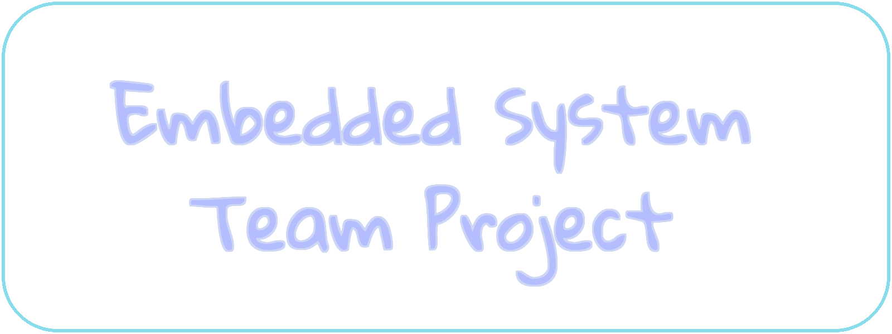

<picture>
  <source media="(prefers-color-scheme: dark)" srcset="./assets/rasptitle-dark.png">
  <source media="(prefers-color-scheme: light)" srcset="./assets/rasptitle-light.png">
  
</picture>

### 건국대학교 전기전자공학부 - 임베디드시스템 17조
> [!NOTE]
> 🧑‍🏫 **담당교수**  
> - 조용범 교수님
>   
> 👨‍💻 **조원**  
> - 202110965 이관호  
> - 201810804 김세연  
> - 202014122 김진구
>   
> 🍓 **Raspberry Pi Info**  
> - 🔭 OS : ~~Buildroot~~ Raspbian (RaspberryPi OS)   
> - 💻 Kernel Version : 6.0.19-v7l+ (32bit arm architecture)   
> - 🌱 Board Version : RaspberryPi 4 - Model B    
> - <details>
> 		<summary><code> $ neofetch</code></summary>
> 		<picture>
> 			<source media="(prefers-color-scheme: dark)" srcset="./assets/rasp-neofetch-dark.png">
> 			<source media="(prefers-color-scheme: light)" srcset="./assets/rasp-neofetch-light.png">
> 			
> 		</picture>
> 	</details>

# Git
주어진 토큰으로 이 레포지토리를 클론한 다음, 각자의 branch로 commit하세요 !!

```
$ git clone https://[ GIVEN TOKEN ]@github.com/vanillaPenguin/RaspberryPi.git
```

## SSH
라즈베리 파이는 부팅과 동시에 연결 가능한 네트워크를 찾고, 연결한다.  
이때, 라즈베리 파이가 라우터에 포트 포워딩 되어 있거나, client기기와 같은 네트워크에 연결되어 있는 경우(내부 통신이 허용된 무선 네트워크 혹은 이더넷 케이블읉 통한 연결 등 : 이하 '같은 네트워크'), 외부에서 `ssh`를 통해서 접속할 수 있다.  
이때, 같은 네트워크를 공유한다는 가정 하에 다음과 같은 커맨드로 연결할 수 있다. Raspberry Pi Imager를 통해 OS를 만들었다면, 그리고 사용하는 OS가 Raspberry Pi OS(혹은 Raspbian)이라면, 사용자 이름과 기기 이름은 기본값으로 각각 `pi`와 `raspberrypi`이기 때문이다.  

```bash
$ ssh pi@raspberrypi.local # by default
$ ssh username@device_name.local # depends on user configuration
```

이때, `.local` 접미사를 통한 연결이 불가능하다면, 혹은 라우터에 포트 포워딩된 Raspberry Pi 에 연결하고자 한다면, 앞에서 `device_name.local` 을 작성해 준 부분에 다음과 같이 ip를 직접 작성해 줘야 한다.  

```bash
$ ssh username@xx.xx.xxx.xxx # ip address 
```

> [!TIP]
> * 🍓 **라즈베리 파이를 wifi에 연결할 수 없는 경우**
> 	1. 다음의 코드를 실행하여 현재 사용 가능한 네트워크의 목록을 확인할 수 있다.
>    		```bash
>    		# nmcli device wifi list
>    		```
> 	2. 사용 가능한 네트워크가 있다면, 다음의 코드를 통해 연결할 수 있다.  
> 		이때, SSID가 와이파이 이름, PASSWORD가 비번이다.
>   		```bash
>    		# nmcli device wifi connect [SSID] password [PASSWORD]
>    		```
>
> * ⁉️ **라즈베리 파이의 IP를 모르겠다면?**
> 	* `ip a` 커맨드를 실행해서 IP를 알아낼 수 있다.  
>   	이때 inet 옆에 xxx.xx.x.xx/xx 이런식으로 되어 있을 텐데, `/`가 나오기 이전까지가 ip 주소이다.

## Raspberry Pi 사용이 끝났다면
뭔가 진행 중이던 작업이 끝났다면 라즈베리 파이를 올바르게 종료해 주는 것도 중요하다. 터미널에서 라즈베리 파이를 종료해 주는 방법은 다음과 같다.  

```bash
$ sudo shutdown -h now
```

여기서, `-h`플래그는 종료 시간을 특정하기 위해 사용될 수 있다. 예를 들어, 5분 뒤에 전원이 꺼지기를 원한다면 다음과 같이 설정해 줄 수 있다.

```bash
$ sudo shutdown -h +5
```

이때, 앞서 소개했던 `now`에 대해서, `-h` 플래그를 생략해 줄 수 있다.

```bash
$ sudo shutdown now
```

## TroubleShooting
1. **OpenCV in C++ path error *(solved)*** : see [here](./ExampleCode/week11/README.md)  
2. **TFLite Flatbuffer version incompatible *(solved)*** : install tflite from [new install script](./ProjectCode/installScript/modified_tensorflow_2.6.0_install.sh), see also [this document](./ProjectCode/installScript)

